# 나.작.귀 화이트 크리스마스🎄 - 자율프로젝트(A-601)

---

[TOC]

---

## 1. 서비스 개요🎸

> ### 나의 작고 귀여운 화이트크리스마스

### 기능

#### 연말, 크리스마스를 기념하는 이벤트 프로젝트, '나의 작고 귀여운 화이트크리스마스'(이하 나.작.귀)는 지인들과 함께 연말의 기쁨과 추억을 서로 주고 받기 위해 탄생했습니다.

##### 나.작.귀는 다음과 같은 기능을 제공합니다.

1. 유저들이 **스노우볼을 3D로 직접 커스텀 할 수 있습니다.** 주어지는 **요소들은 약 8가지의 분류**로 제공되며 **모든 요소의 개수는 총 70개 정도** 제공됩니다.

   - 유저가 처음으로 회원가입을 하면 자동으로 해당 유저에게는 디폴트 상태의 스노우볼이 주어집니다.
   - 유저는 **본인의 스노우볼을 커스텀** 할 수 있습니다.
   - 유저는 다른 유저에게 **스노우볼을 만들어 선물**해줄 수 있습니다.
     - 이 때, 스노우볼을 선물하는 유저는 본인이 만든 **스노우볼을 본인도 공유할 것인지 여부를 선택**할 수 있습니다.
   - **비회원 유저도 회원 유저들에게 스노우볼을 선물**할 수 있습니다.

   

2. 유저들이 각 **스노우볼과 일치하는 요소들을 내부에 지닌 유니티 마을**로도 이동할 수 있습니다.

   

3. 유저들은 타 유저들끼리 **친구관계를 맺을 수 있습니다.**

   - 유저는 친구보기 페이지에서 본인과 친구가 아닌 서비스 유저를 검색해서 친구 추가 요청을 보낼 수 있습니다.

   - 이 때, 친구 관계를 상호 간 모두 동의를 해야 맺어집니다.

   - 단, 둘 중 하나라도 타 유저를 친구 목록에서 삭제한다면 친구 관계가 취소됩니다.

   

4. 유저들은 유저들끼리 **방명록에 글과 사진을 남길 수 있습니다.**

   - 방명록의 글은 본인이 작성한 경우 수정, 삭제할 수 있습니다.

   

5. 유저들은 본인의 **메인 페이지 url를 클립보드에 복사, 본인의 sns 계정에 공유**할 수 있습니다.

   

6. **기타 기능**들은 다음과 같습니다.

   1. 로그인은 카카오 소셜로그인으로만 이뤄지며,  최초 로그인은 회원가입으로 처리됩니다. 
   2. 닉네임을 변경할 수 있습니다. 닉네임은 중복확인 후 중복되지 않는 경우에만 변경 가능합니다.
   3. 나의 컬렉션 보기 페이지에서 본인의 기본 스노우볼, 친구에게 선물 받은 스노우볼, 친구와 공유한 스노우볼을 모두 확인할 수 있습니다.
      - 이 때, 컬렉션에서 자신의 메인에서 보고 싶은 스노우볼을 확인할 수 있습니다.


> ### 서비스명 / 도메인명 / 로고 / 아이덴티티 컬러

### 서비스명

- #### 나의 작고 귀여운 화이트 크리스마스

  나의 작고 귀여운 화이트 크리스마스는 언제나 안에 눈이 내리는 작은 스노우볼을 빗댄 이름입니다.


### 도메인명

- #### [mylittlesnowball](https://mylittlesnowball.com)

  도메인으로 쓰기에 쉽도록 변경하였습니다.


### 로고

- #### 메인로고

  

- #### 파비콘로고

  


### 아이덴티티 컬러🎨

- #### 🟢Green & 🔴Red & 🟡Ligth Yellow

  - 크리스마스를 상징하는 초록, 빨강, 노랑을 사용하였고, 전체적으로 차분한 느낌의 UI를 위해서 톤다운된 색을 사용하였습니다.


---

## 2. 팀원 소개 및 역할 😎

### 팀장 : 남성은 (Frontend)

- 와이어 프레임 제작
- UI / UX 구상
- 일러스트 제작
- React 프로젝트 개발

### 팀원 : 고유라 (Backend)

- ERD 제작
- API 개발
- CI / CD
- 배포

### 팀원 : 백승훈 (Backend)

- ERD 제작
- API 개발
- CI / CD
- 배포

### 팀원 : 손민지 (Backend)

- ERD 제작
- API 개발
- CI / CD

### 팀원 : 오채명 (Frontend)

- 와이어 프레임 제작
- UI / UX 구상
- Unity 환경 개발
- React 프로젝트 개발

### 팀원 : 원민석 (Frontend)

- UI / UX 구상
- Three.js로 스노우볼 제작
- Unity 환경 개발
- React 프로젝트 개발


---

## 3. 기획과 구상💡

### 기획의도

- #### 연말과 크리스마스를 맞이해서 소중한 사람들에게 안부를 전하는 것을 좀 더 재미있게 만들기 위해,

  #### 이벤트성 프로그램으로 3D 요소와 유니티 환경을 추가한 프로젝트를 기획했습니다.

- #### 어플을 깔아야하는 번거로움을 덜기 위해 모바일 환경에 최적화 된 웹 서버로 제작했습니다.


### ERD

#### - [ERDCloud](https://www.erdcloud.com/d/2rBNkRkX9djBXAsAN)


### 와이어프레임

#### - [Figma](https://www.figma.com/file/gXm7jYNyc1DVKgzznc8p3s/A601)


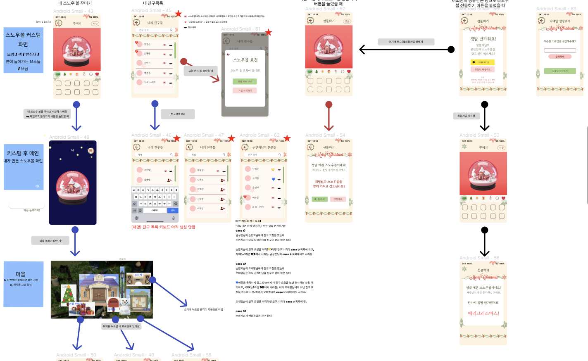


### 파일구조

#### - 백엔드

```
Backend
  ├── .gradle
  ├── .idea
  ├── grable/wrapper
  ├── src
  |    ├── main
  |    |     ├── java/com/ssafy/doyouwannabuildasnowball
  |    |     |     ├── common
  |    |     |     ├── config
  |    |     |     ├── controller
  |    |     |     ├── domain
  |    |     |     ├── dto
  |    |     |     ├── repository
  |    |     |     ├── service
  |    |     |     └── DoyouwannabuildasnowballApplication.java
  |    |     └── resources
  |    |           └── application.yml
  |    └── test/java/com/ssafy/doyouwannabuildasnowballApplicationTests.java
  |
  ├── Dockerfile
  ├── bulid.gradle
  ├── gradlew
  ├── gradelw.bat
  └── settings.gradle
```

#### - 프론트엔드

```
Frontend
  ├── conf/conf.d
  ├── node_modules
  ├── public
  ├── src
  |     ├── app
  |     ├── assets
  |     |     ├── unity
  |     |     ├── fonts
  |     |     └── images
  |     ├── component
  |     |     ├── custom/customlist.tsx
  |     |     ├── navbar/navbar.tsx
  |     |     ├── search/search.tsx
  |     |     └── three
  |     |		   ├── Bulding
  |     |		   ├── C_Tree
  |     |		   ├── Objet1
  |     |		   ├── Objet2
  |     |		   ├── Objet3
  |     |		   ├── Pets
  |     |		   ├── Snowman
  |     |		   ├── Group.js
  |     |		   ├── MainContainer.js
  |     |		   ├── MainContainer.module.css
  |     |		   └── SnowGlobe_ligth.js
  |     ├── features
  |     |     ├── shelfSlice.tsx
  |     |     ├── snowballSlice.tsx
  |     |     └── useSlice.tsx
  |     ├── pages
  |     |     ├── askforshare.tsx , askforshare.module.css
  |     |     ├── board.tsx , board.module.css
  |     |     ├── collection.tsx , collection.module.css
  |     |     ├── custommain.tsx , custommain.module.css
  |     |     ├── friends.tsx , friends.module.css
  |     |     ├── intro.tsx , intro.module.css
  |     |     ├── merrychristmas.tsx , merrychristmas.module.css
  |     |     ├── setnickname.tsx , setnickname.module.css
  |     |     ├── tutorial.tsx , tutorial.module.css
  |     |     └── welcome.tsx , welcome.module.css
  |     ├── index.tsx , index.css
  |     ├── logo.svg
  |     ├── reportWebVitals.ts
  |     ├── react-app-env.d.ts
  |     ├── setupTests.ts
  |     └── switchurl.tsx
  ├── .gitignore
  ├── Dockerfile
  ├── nginx.conf
  ├── package-lock.json
  ├── package.json
  └── tsconfig.json
```


---

## 4. 기술 스택 및 협업 툴⚙

### 기술 스택💻

- #### Backend - JAVA 

  - ##### Java

  - **JPA**

  - **spring boot**

  - **spring security**

  - **mysql**

  - **mongodb**

  - **aws s3**


- #### Frontend - React

  - **vscode**
  - **React**
  - **ReactRouter**
  - **Redux**
  - **MUI**
  - **Three.js**
  - **Unity**
  - **Html / CSS**
  - **TypeScript**
  - **ECMAScript**
  - **Axios**

- #### CI / CD

  - **Jenkins 2.361.3**
  - **Nginx**
  - **Docker 20.10.21**


---

### 협업 툴🛠

#### Git, [Gitlab](https://lab.ssafy.com/s07-ai-image-sub2/S07P22A202)

- ##### 컨벤션

  - Git Flow

    **메인 브렌치 - 항상 유지**

    - main(master) : 개발 종료 후 최종 브랜치
    - develop : 개발 브랜치

    **보조 브렌치**

    - frontend : 프론트엔드 기능을 merge하는 브랜치
    - backend : 백엔드 기능을 merge하는 브랜치
    - feature : 기능을 개발하는 브랜치 - 각각 frontend, backend 브랜치에 머지
      - feature-[백 또는 프론트]-[해당 브랜치의 개발 내용]
    - release : develop 브렌치에 모두 merge 후 테스트하는 브렌치
    - hotfix : release에서 발생한 버그를 수정하는 브렌치

    **Git Commit Convention**

    기본적으로 커밋 메시지는 제목/본문/꼬리말로 구성한다

    - type
      - feat : 새로운 기능 추가
      - fix : 버그 수정
      - docs : 문서 수정
      - style : 코드 포맷팅, 세미콜론 누락, 코드 변경이 없는 경우
      - refactor : 코드 리팩토링
      - test : 테스트 코드, 리팩토링 테스트 코드 추가
      - chore : 빌드 업무 수정, 패키지 매니저 수정
      - design : UI 디자인 변경 (css 등)
      - comment : 주석 추가 및 변경
      - rename : 파일명, 폴더명 수정 또는 이동
      - remove : 파일 삭제
        - setting : 프로젝트 세팅
    - Body
      - 선택사항. 모든 커밋에 작성할 필요 없음
      - 부연설명이 필요하거나 커밋의 이유를 설명할 경우 작성
      - 72자 이하. 제목과 구분되기 위해 한칸을 띄워 작성
    - footer
      - 선택사항. 모든 커밋에 꼬리말 작성할 필요 없음
      - issue tracker id를 작성할 때 사용


---

#### [Notion](https://www.notion.so/A601-0fc31de314984606aee4db96e92de432)

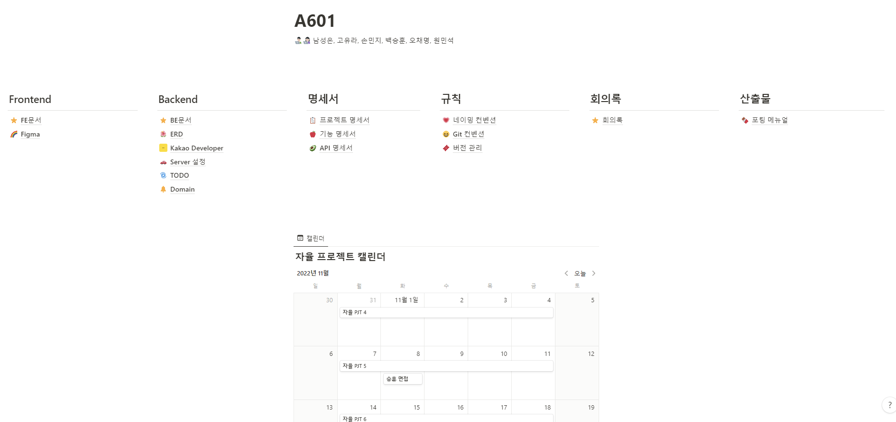


---

#### [Jira](https://ssafy.atlassian.net/jira/software/c/projects/S07P31A601/boards/40)

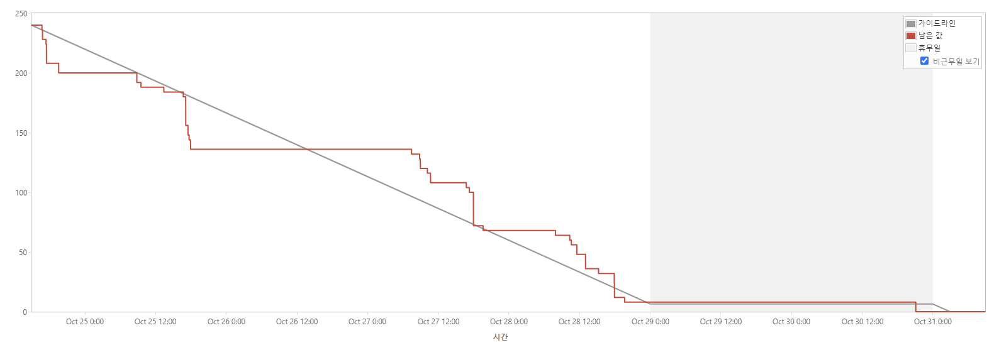

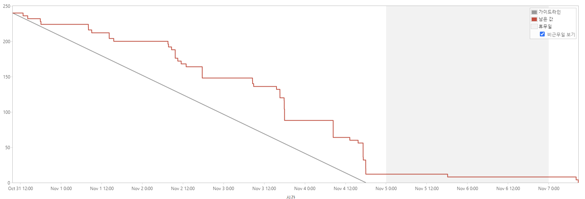

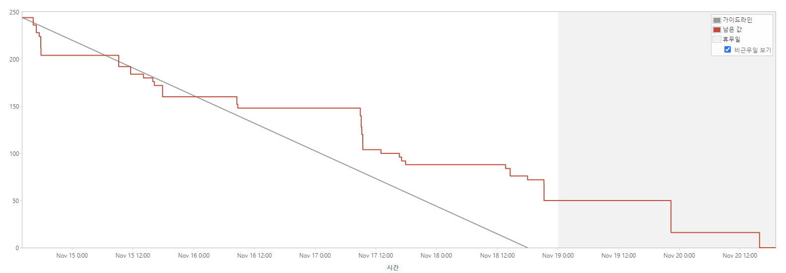


---

#### Webex

- 팀회의, 팀미팅
- 원격조정

#### MatterMost

- 팀 메시지
- 개인 DM

#### Discord

- 화면 공유 및 회의

 

---

## 5. 서비스 구성

### [ Sign up / Login ]

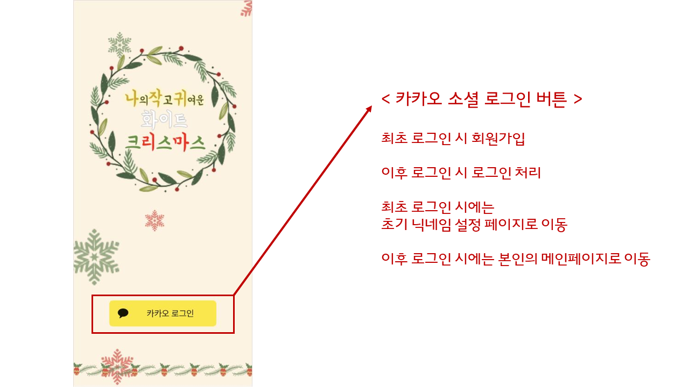


---

### [ Custommain ]

- #### 내 페이지인 경우

  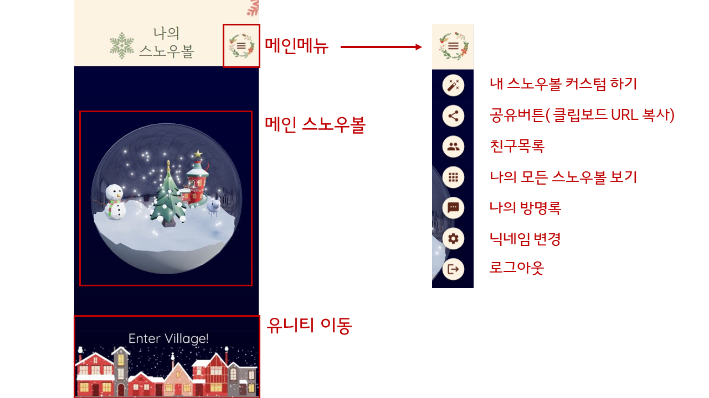

  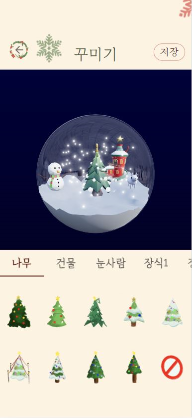


- #### 남의 페이지인 경우

  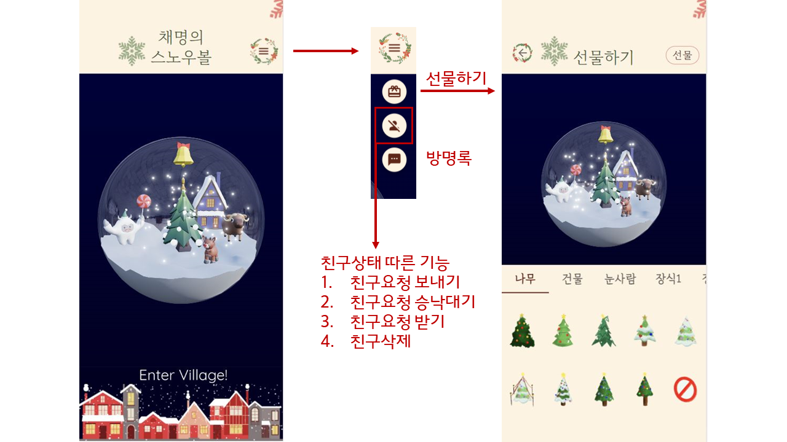

  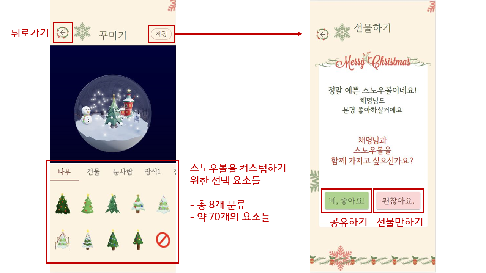


---

### [ Friends ]

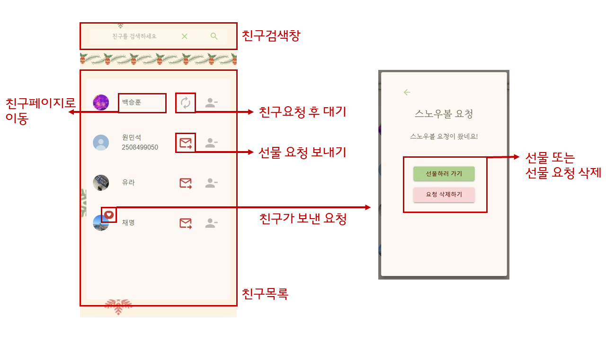

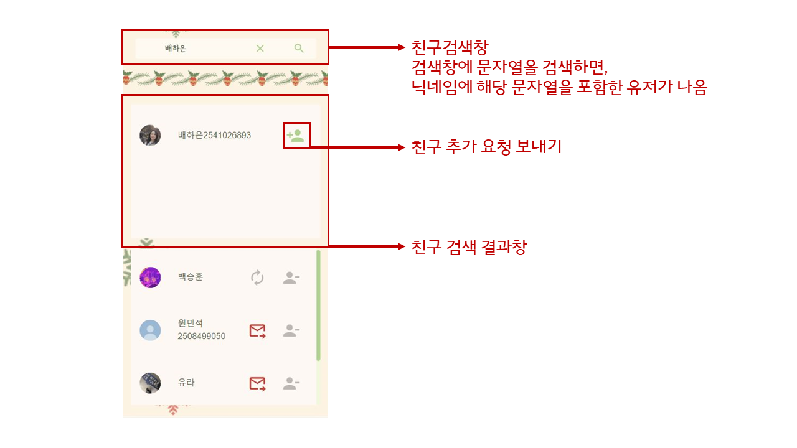

---

### [ Board ]

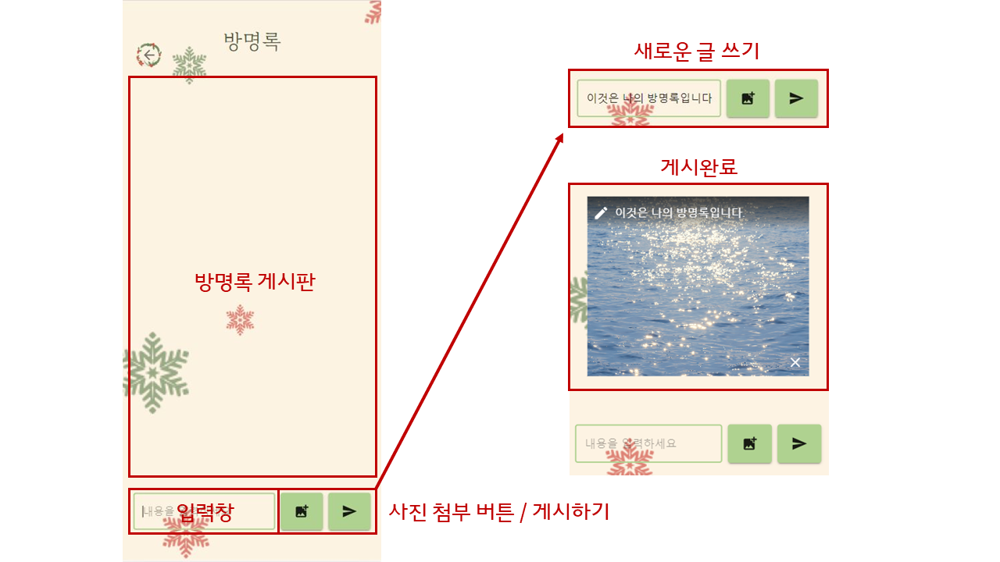


---

### [ Collection ]

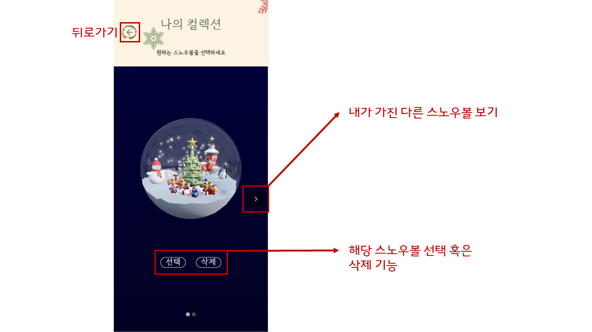


---

### [ Setnickname ]

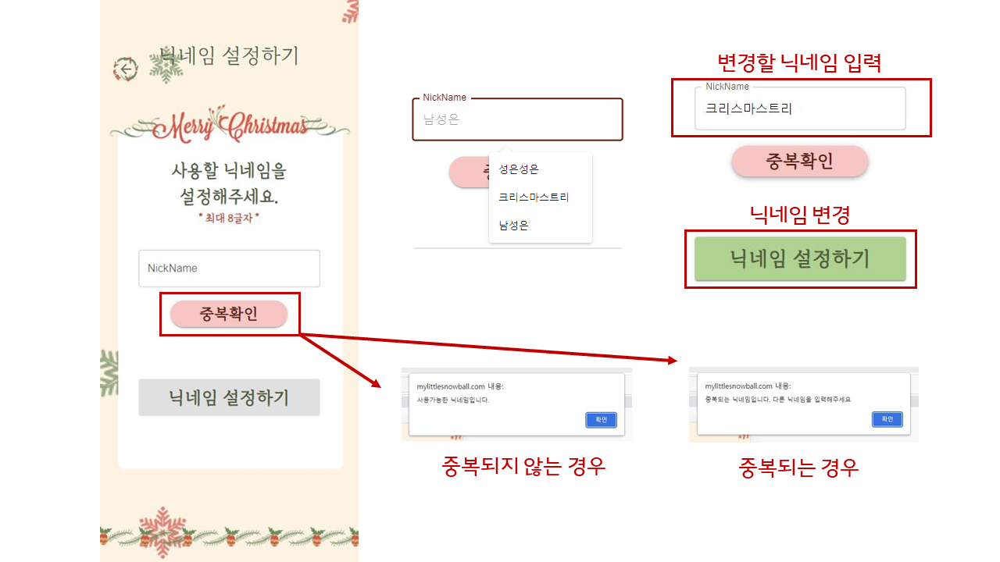


---

### [ Unity ]

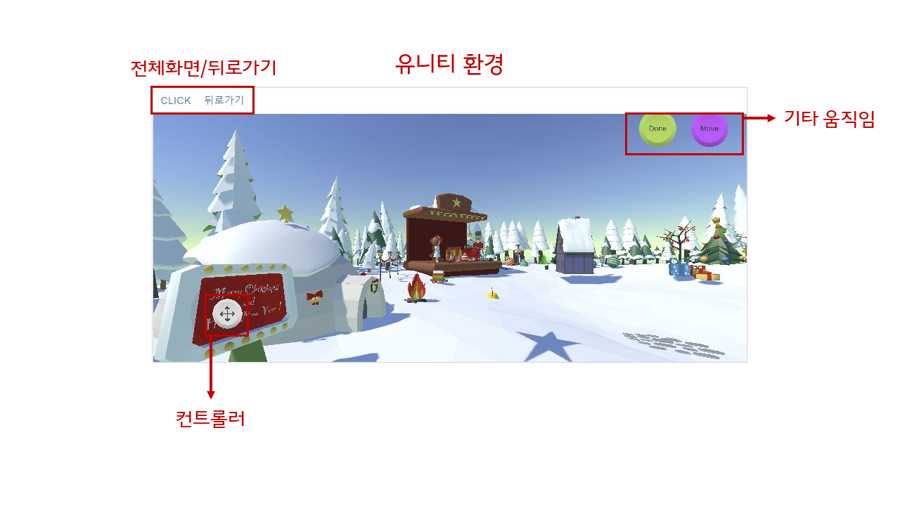


---

### [ Askforshare ]

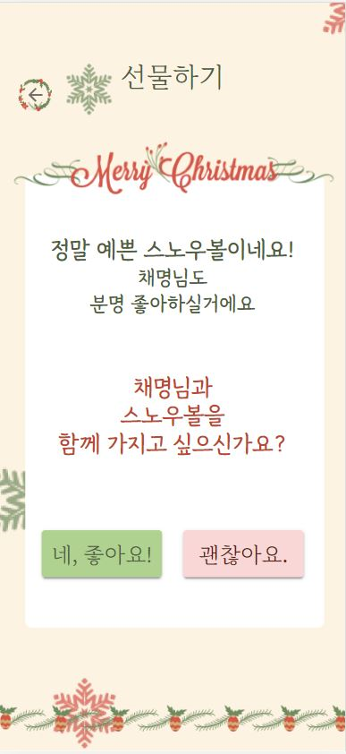


---

### [ Welcome / Merrychirstmas]

- #### 비회원이 접속해서 선물하는 경우

  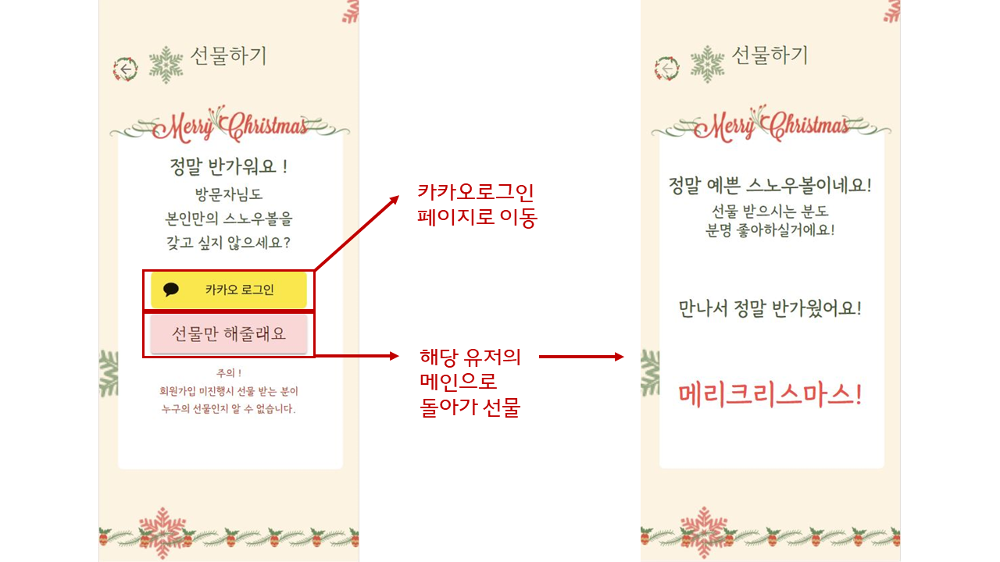

---